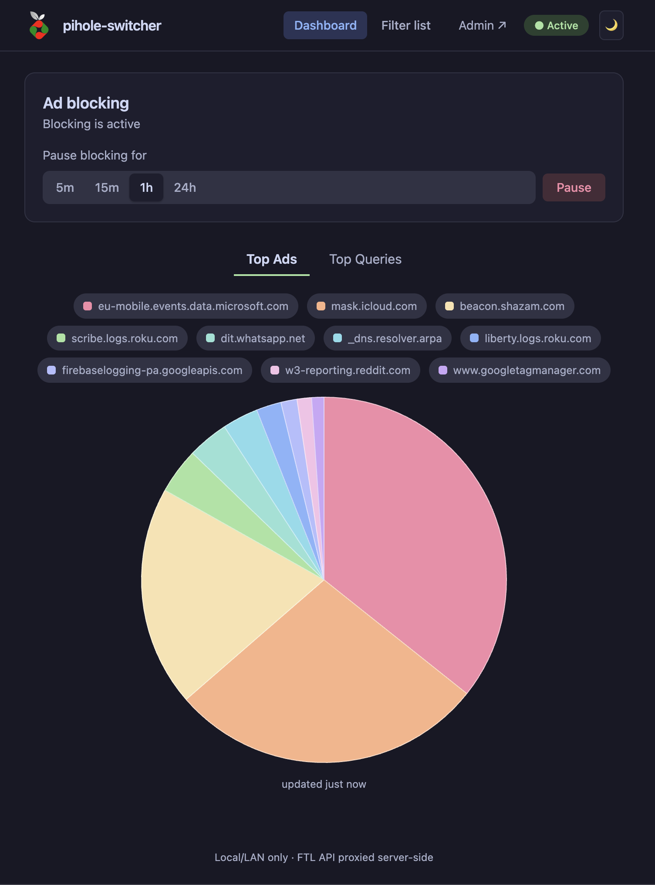
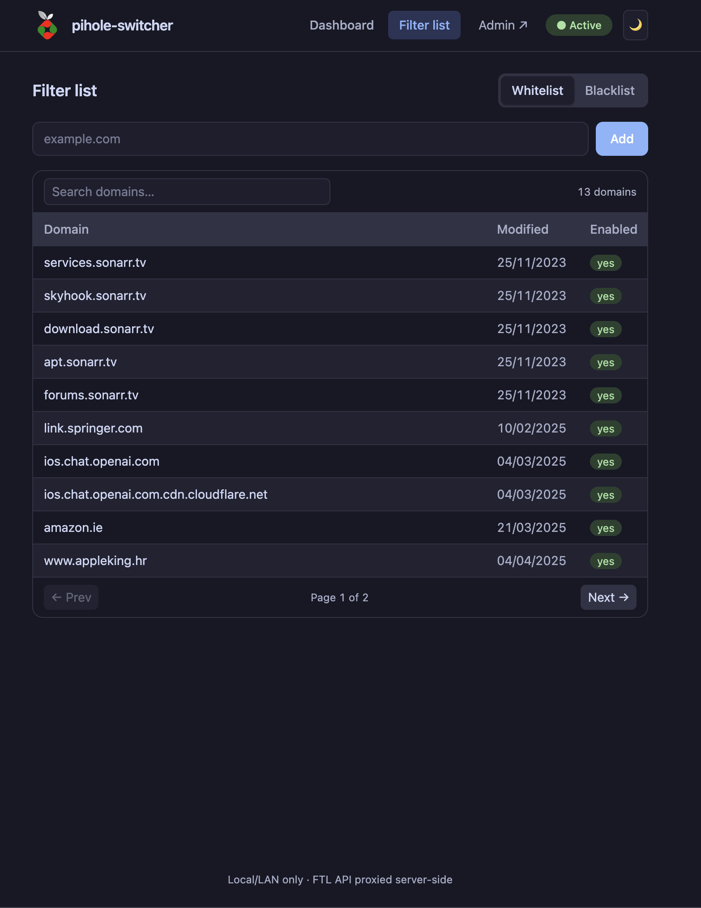

[](https://sonarcloud.io/summary/new_code?id=mikicvi_pihole-switcher) [](https://sonarcloud.io/summary/new_code?id=mikicvi_pihole-switcher) [](https://sonarcloud.io/summary/new_code?id=mikicvi_pihole-switcher) [](https://sonarcloud.io/summary/new_code?id=mikicvi_pihole-switcher)

# pihole-switcher

Switch Pi-hole DNS blocking on and off from a small, fast web UI — with the FTL API password living **only server-side**.

Built as a single SvelteKit (Svelte 5 + Node 22) container. One process serves the UI _and_ proxies a tiny, allowlisted slice of the Pi-hole FTL API.

# Preview




## Features

- **Pause/resume ad blocking** — pick a duration (5m / 15m / 1h / 24h), watch
  a live countdown with a progress bar, and blocking resumes itself. One
  control per state: Pause when active, Resume now while paused.
- **Top Ads / Top Queries charts** — an animated chart.js pie of the top 10
  domains: sweep-in animation, hover tooltips, and clickable legend chips that
  hide/show slices. Refreshes every 60s.
- **Filter list** — the exact whitelist and blacklist: add domains, search the
  list, per-domain enabled state, pagination.
- **Themes that follow your OS** — Catppuccin (Latte light / Mocha dark).
  Auto mode tracks the OS light/dark setting live; a manual toggle sticks.
  Mobile-first layout, built for the phone in the living room.
- **Server-side FTL proxy** — the browser only ever talks to _this_ app. The
  FTL API password and session tokens never reach the client bundle.
- **Admin link in the header** — opens the Pi-hole admin UI in a new tab,
  working out of the box (defaults to the FTL host + `/admin`).

## Security model

| What                                    | Where it lives                                                             |
| --------------------------------------- | -------------------------------------------------------------------------- |
| FTL API password                        | Container environment (`PIHOLE_API_PASSWORD`), server process only         |
| FTL session (`X-FTL-SID`, `X-FTL-CSRF`) | Server process memory, lazily acquired, single-flight, auto-retried on 401 |
| Browser → app                           | Same-origin HTTP, no credentials, no secrets                               |
| App → FTL                               | Plain HTTP to the FTL host (LAN-only app; see notes below)                 |

The proxy only forwards the five FTL v6 endpoints the UI uses
(`dns/blocking/status`, `dns/blocking`, `stats/top_domains`,
`domains/allow/exact`, `domains/deny/exact`) — anything else gets a 404.
Errors: `503 auth_failed` (bad/missing password), `502 ftl_unreachable`
(FTL host not reachable), `404` unknown path.

Deployed responses carry `X-Content-Type-Options: nosniff`,
`X-Frame-Options: DENY` and `Referrer-Policy: strict-origin-when-cross-origin`.

> **Network note:** pihole-switcher is intended for **local/LAN use**. It
> talks to FTL over plain HTTP (the default FTL setup). Don't expose it to the
> internet; put it behind your VPN or keep it on the LAN.

## Deployment

### Docker (any homelab)

The image is `mikicv/pihole-switcher` on Docker Hub (multi-arch: amd64,
arm64, arm/v7), published automatically on merges to `master`:

- `latest` — newest release
- `master-<sha>` — exact release per merge (pin this for reproducibility)

<details>
<summary>docker compose</summary>

```yaml
services:
    pihole-switcher:
        image: mikicv/pihole-switcher:latest
        ports:
            - '3016:3000'
        environment:
            PIHOLE_API_PASSWORD: your-ftl-api-password
            # where FTL lives, as seen from the container (default 192.168.1.1):
            # PIHOLE_PROXY_TARGET: 192.168.1.12
        restart: unless-stopped
```

</details>

<details>
<summary>Portainer custom template</summary>

Create a custom template pointing at `mikicv/pihole-switcher`, container port
`3000`, published port `3016` (or your choice), environment variables:

| Variable              | Required | Default                                         | Meaning                                                                                                                                                                               |
| --------------------- | -------- | ----------------------------------------------- | ------------------------------------------------------------------------------------------------------------------------------------------------------------------------------------- |
| `PIHOLE_API_PASSWORD` | **yes**  | —                                               | Plain FTL v6 API password (Settings → Web server → API password).                                                                                                                     |
| `PIHOLE_PROXY_TARGET` | no       | `192.168.1.1`                                   | FTL host _as seen from the container_. When pihole-switcher runs on the same machine as a Pi-hole in Docker, the docker bridge gateway (`172.17.0.1`) or the host's LAN IP usually works. |
| `PIHOLE_FTL_PORT`     | no       | `1010`                                          | FTL API port (FTL v6 serves the REST API on **1010**, not 8080).                                                                                                                      |
| `PUBLIC_PIHOLE_ADMIN` | no       | `<PIHOLE_PROXY_TARGET>:<PIHOLE_FTL_PORT>/admin` | Override the admin link in the header (use when the FTL host is not browser-reachable, e.g. Docker-internal addresses).                                                               |
| `PORT`                | no       | `3000`                                          | Container listen port.                                                                                                                                                                |

</details>

After starting, open `http://<host>:3016`. The container ships a
`HEALTHCHECK` on `/health` so Docker/Portainer shows it as _healthy_ once the
app is serving.

### FTL v6 password — gotcha

FTL v6 has **two** passwords: the plain _API password_ (what this app needs)
and the 64-character _app password_ (a SHA-256 of the plain one). Only the
**plain** password is accepted by `/api/auth`. If you only have the app
password, reset the API password in FTL → Settings → Web server.

## Development

```bash
npm ci
cp .env.example .env   # fill in PIHOLE_API_PASSWORD (and *_PROXY_TARGET if needed)
npm run dev            # http://localhost:5173
```

`.env` values are read by SvelteKit on the server; `PUBLIC_*`-prefixed values
would also be exposed to the browser (we don't use any).

```bash
npm test               # vitest run --coverage
npm run check          # svelte-kit sync && svelte-check
npm run build          # vite build → build/ (node build runs it)
```

### Architecture

```
Browser ──same origin──▶ SvelteKit (adapter-node, :3000)
                              │
                              ├─ /            UI (Svelte 5, Tailwind 4)
                              ├─ /health      liveness probe
                              └─ /api/dns/… /api/stats/… /api/domains/…   (5 allowlisted FTL v6 paths)
                                       │  allowlisted proxy
                                       ▼
                              FTL (:1010)  password + session kept server-side
```

- `src/lib/piholeClient.ts` — server FTL client: lazy login, sid/csrf headers,
  single-flight logins, 401 retry, cooldown after auth failure.
- `src/routes/api/[...path]/+server.ts` — the allowlisted proxy.
- `src/lib/api.ts` — browser client (fetch, no secrets).
- `tests/` — component + route tests; `mockFtl.ts` is a stateful in-process
  FTL v6 fake (real `node:http` server) used by the route tests.

### Releases

- `.github/workflows/build.yaml` — CI: `npm ci`, svelte-check, vitest, build,
  SonarCloud scan.
- `.github/workflows/docker-publish.yaml` — on merges to `master`: builds and
  pushes multi-arch images (`latest`, `master-<sha>`, ref/PR tags). Runs are
  concurrency-gated so exactly one publishes per merge.

## License

MIT — see [LICENSE](LICENSE).
